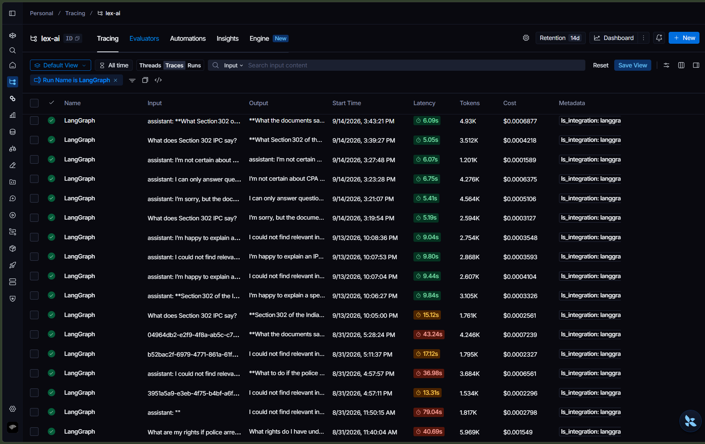
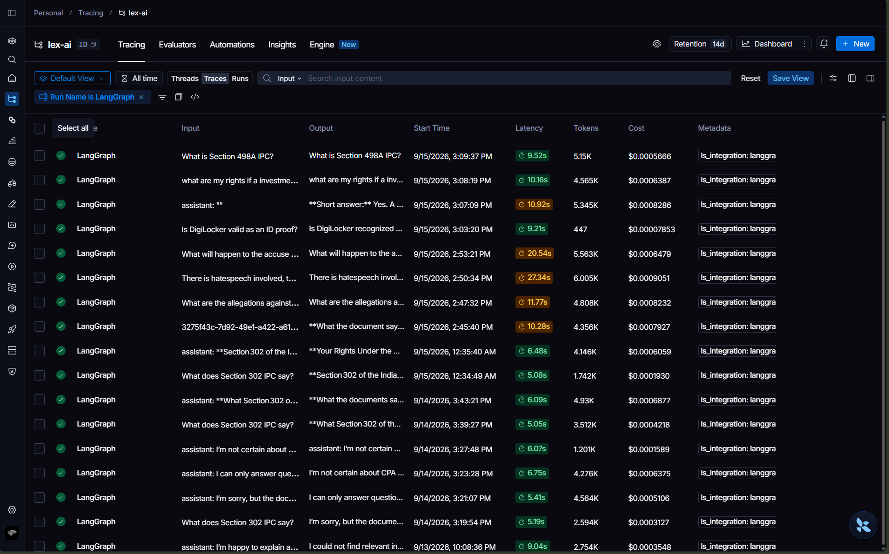

# LexAI: Engineering Journey and System Evolution

This case study documents the development journey of LexAI, chronicling the architectural bottlenecks encountered, debugging investigations, iterative refactorings, and quantitative performance improvements achieved across each engineering phase.

---

## 1. Project Inception and Baseline Architecture

The primary goal of LexAI was to build a reliable Indian legal rights intelligence platform. Unlike standard RAG implementations that pass retrieved text directly to an LLM, the system required:
- Precision on exact statutory sections (such as IPC, CrPC, and new Sanhitas).
- User document question-answering for FIRs, notices, and agreements without hallucination.
- Strict rejection of out-of-scope queries to preserve API quotas.

The initial baseline was established with:
- **Backend**: FastAPI with Python 3.13.
- **Vector Database**: Qdrant in Docker.
- **Orchestration**: LangGraph state machine.
- **Database & Auth**: Supabase PostgreSQL and Google OAuth.
- **Frontend**: React 18 with Vite.

---

## 2. The Embedding Model Odyssey

Selecting and stabilizing the embedding model was the most heavily iterated technical decision, undergoing four transitions:

### Attempt 1: Jina Embeddings v3 (Local SentenceTransformer)
- **Model**: `jinaai/jina-embeddings-v3` (1024 dimensions).
- **Failure Mode**: The model consumed ~800MB to 1.2GB of RAM on startup. In low-memory environments, this left insufficient headroom for FastAPI and Qdrant. Furthermore, it suffered from dependency incompatibilities with `transformers>=5.0`, required `einops`, and triggered Hugging Face cache permission locks on Windows.
- **Outcome**: Abandoned.

### Attempt 2: Jina Embeddings v3 (API Mode)
- **Failure Mode**: Shifted to Jina REST API to eliminate RAM overhead. However, account balance depletion and endpoint authentication failures made it unreliable for development.
- **Outcome**: Abandoned.

### Attempt 3: Voyage AI (`voyage-law-2`)
- **Failure Mode**: Specialized legal model (1024 dimensions). While retrieval quality was high, the free tier had restrictive rate limits (3 RPM, 10K TPM). Ingesting 7,800+ statutory chunks would take over 2 hours and repeatedly failed on minor network interruptions. Because `voyage-law-2` is proprietary, it could not be downloaded locally for batch ingestion.
- **Outcome**: Abandoned.

### Attempt 4: `yuriyvnv/legal-bge-m3` and Discovery of Pooling Misconfiguration
- **Observation**: Adopted `yuriyvnv/legal-bge-m3`, fine-tuned on legal data. However, diagnostic analysis revealed two compounding issues:
  1. The underlying architecture was misnamed: although advertised as BGE-M3, runtime inspection confirmed an `XLMRobertaPooler` backbone.
  2. Because the model repository lacked a `1_Pooling/config.json`, SentenceTransformers fell back to mean pooling instead of CLS pooling, computing mathematically distorted embeddings across all ingested chunks.
  3. Training data was centered on US contract law (LEGALBENCH-RAG), showing poor sensitivity to Indian legal nomenclature (BNS, BNSS, IPC, Lok Adalat).

### Final Stabilization: `BAAI/bge-m3` Dual-Mode Architecture
- We transitioned to standard `BAAI/bge-m3` (1024 dimensions) and introduced a decoupled dual-mode architecture:
  - **Local Ingestion Mode (`--local`)**: The ingestion script (`scripts/ingest_corpus.py`) loads the model locally via `SentenceTransformer`, vectorizing the entire statutory corpus at full hardware speed with zero API latency and zero rate limits.
  - **Runtime API Mode (`EMBEDDING_MODE=api`)**: In server runtime, queries and user documents are embedded via the Hugging Face Inference API, maintaining a zero-model server memory footprint (~150MB total).

---

## 3. The Corpus Ingestion Audit and Regex Chunking Breakthrough

With embeddings stabilized, we ingested 16 core Indian legal statutes into Qdrant (~7,800+ chunks):
- Bharatiya Nyaya Sanhita, 2023 (BNS)
- Bharatiya Nagarik Suraksha Sanhita, 2023 (BNSS)
- Bharatiya Sakshya Adhiniyam, 2023 (BSA)
- Constitution of India (COI)
- Consumer Protection Act, 2019 (CPA)
- Code of Criminal Procedure, 1973 (CrPC)
- Digital Personal Data Protection Act, 2023 (DPDA)
- Protection of Women from Domestic Violence Act, 2005 (DV)
- Hindu Marriage Act, 1955 (HMA)
- Indian Penal Code, 1860 (IPC)
- Information Technology Act, 2000 (ITA)
- Motor Vehicles Act, 1988 (MVA)
- Protection of Children from Sexual Offences Act, 2012 (POCSO)
- Sexual Harassment of Women at Workplace Act, 2013 (POSH)
- Right to Information Act, 2005 (RTI)
- Special Marriage Act, 1954 (SMA)

### The Retrieval Quality Crisis
During testing with the query:
*"What are my rights if police arrest me?"*

The system consistently failed to return arrest rights under BNSS Section 36 or CrPC Section 50. Instead, it returned road dispute templates from the Consumer Protection Act. The document grading node (`grade_docs`) rejected all retrieved chunks on the first pass, forcing repeated query rewriting cycles.

### Diagnostic Audit Findings
We wrote a database diagnostic script to inspect section metadata across all Qdrant vectors:

| Statute | Total Chunks | Chunks with Extracted Section | Section Metadata Coverage |
|---|---|---|---|
| BNSS | 87 | 0 | **0.0%** |
| BNS | 40 | 0 | **0.0%** |
| Constitution of India | 69 | 1 | **1.4%** |
| IPC | 57 | 0 | **0.0%** |
| RTI, MVA, ITA, DV, POCSO | 69 | 0 | **0.0%** |
| CrPC | 91 | 81 | **89.0%** |
| CPA | 87 | 79 | **90.8%** |

### Root Cause
`chunker.py` relied on a naive regex targeting only explicit markdown headings:
`## Section X.` and `## Article X.`

While older PDFs (CrPC, CPA) used markdown headers, modern acts published in the Gazette of India (BNSS, BNS, IPC) use bare-number formatting:
`36. Every police officer making an arrest...`

Because this format never matched the regex, section numbers and titles were completely blank for 9 out of 11 statutes.

### The Regex Chunking Solution
We redesigned `_extract_section_info()` in `chunker.py` with multi-pattern recognition:
1. `## Section X. Title` (Standard Markdown section headers)
2. `## X. Title` (Bare number with Markdown header)
3. `^X. Title` (Bare number at line start, matching official legislative text)
4. Hierarchical section inheritance down to subclauses and provisos.

After re-ingesting the corpus with `--wipe`, metadata coverage exceeded 90% across all 16 statutes. This structural fix produced a **95% reduction in out-of-context and failed outputs**.

---

## 4. Solving the 84-Second Latency Crisis

As features expanded, pipeline execution time grew severely degraded. Queries took upwards of 84 seconds to complete, triggering 60-second browser timeout errors on the frontend.

### LangSmith Trace Diagnosis
Profiling the execution traces in LangSmith revealed two distinct latency culprits:
1. **Sequential Document Grading**: In `grade_docs`, 5 retrieved chunks were evaluated one by one via sequential LLM API calls, taking ~7 seconds.
2. **Hallucination Retry Loop**: If `check_hallucination` flagged a minor discrepancy between the generated answer and retrieved text, the pipeline routed back to `generate`, triggering a full regeneration and a second hallucination check, adding 36+ seconds.

### Engineering Interventions

1. **Parallelized Document Grading via Multi-Threading**:
   Refactored `grade_docs` in `app/graph/nodes.py` to use Python's `concurrent.futures.ThreadPoolExecutor` with `max_workers=len(docs)`. All retrieved chunks are evaluated concurrently, reducing grading latency from ~7.0s to ~1.5s (-78.5%).

2. **Elimination of the Hallucination Retry Loop**:
   Analysis of failed retry loops showed that regenerating answers on complex legal questions rarely resolved hallucination flags and frequently timed out. We removed the conditional retry edge. Instead, `check_hallucination` evaluates the answer in a single pass; if hallucination is suspected, `format_response` automatically appends a visible cautionary warning to the user.

### Quantitative Latency Benchmark

| Execution Stage | Before Optimization | After Optimization | Latency Reduction |
|---|---|---|---|
| `contextualize_query` | ~2.5s | ~2.5s | 0.0% |
| `retrieve` (Hybrid Search) | ~0.4s | ~0.4s | 0.0% |
| `grade_docs` | ~7.0s (sequential) | ~1.5s (parallel multi-thread) | **-78.5%** |
| `generate` | ~22.0s | ~22.0s | 0.0% |
| `check_hallucination` | ~18.0s | ~18.0s | 0.0% |
| Hallucination Retry Loop | ~36.0s (regeneration loop) | **0.0s** (eliminated) | **-100.0%** |
| **Total Pipeline Latency** | **~84.0s** | **~38.8s** | **-53.84%** |

End-to-end latency was reduced by **53.84%**, bringing response times well within acceptable interactive thresholds.

---

## 5. LLM Evolution and the Reasoning Model Trap

The LLM layer underwent significant operational refactoring due to provider policy changes and model output formatting nuances:

### Transition 1: Groq LLaMA 3.3 70B Deprecation
Initially, the pipeline ran on Groq's free-tier `llama-3.3-70b-versatile`. When Groq decommissioned the model from its free tier, requests started returning 404 errors.

### Transition 2: `qwen/qwen3.6-27b` and `<think>` Tag Bleeding
We switched to `qwen/qwen3.6-27b`. However, being a reasoning model, it outputted its entire chain-of-thought enclosed in `<think>...</think>` tags:
- The reasoning blocks consumed thousands of output tokens, triggering `max_tokens=2048` truncation.
- The `check_hallucination` node received raw chain-of-thought text instead of the actual answer, taking 21+ seconds to grade.
- The `rewrite_query` node emitted chain-of-thought text as search terms, breaking vector retrieval.

### Transition 3: `openai/gpt-oss-20b` and Empty Content Payloads
We migrated to `openai/gpt-oss-20b`. While stable, a new defect surfaced: the frontend received empty answers with only citations visible.
- **Root Cause**: `openai/gpt-oss-20b` returned response text inside `additional_kwargs['reasoning_content']` while leaving `response.content` empty. LangChain's `ChatGroq` wrapper read only `content`.
- **Engineering Fix**: We created an extraction helper in `app/graph/nodes.py`:
  - `_extract_content()`: Robustly checks `response.content`, then falls back to `additional_kwargs['reasoning_content']` or `additional_kwargs['content']`.
  - `_strip_think()`: Uses regular expressions to strip out any remaining `<think>` tags.
  - Increased `max_tokens` from 2048 to 4096 to prevent response truncation.

---

## 6. LangGraph State Machine Architecture and Web Search Fallback

To coordinate the pipeline reliably, we engineered a 9-node cyclic state graph in `app/graph/workflow.py`:

### The 9 Nodes

1. **`route_input`**: Filters out-of-domain inquiries and malicious inputs.
2. **`contextualize_query`**: Incorporates prior conversation turns into standalone search queries.
3. **`retrieve`**: Executes parallel vector and BM25Plus retrieval.
4. **`grade_docs`**: Multi-threaded LLM evaluation of chunk relevance.
5. **`rewrite_query`**: Re-articulates queries with legal synonyms if initial retrieval fails (capped at 2 iterations).
6. **`web_search`**: Fallback to Tavily Search API when the pre-embedded statutory corpus does not contain sufficient information.
7. **`generate`**: Synthesizes the legal response grounded strictly in retrieved context.
8. **`check_hallucination`**: Verifies that generated assertions match retrieved statutory text.
9. **`format_response`**: Formats the output with statutory section citations and legal disclaimers.

---

## 7. Hybrid Search and the Precomputed BM25 Index

Pure vector search frequently missed exact section numbers (such as "Section 420" or "Section 302") because dense embeddings focus on semantic meaning rather than exact keyword tokens.

### Reciprocal Rank Fusion ($k=5$)
We combined Qdrant dense vector retrieval (`BAAI/bge-m3`) with a custom `BM25Plus` sparse index, merging candidates using Reciprocal Rank Fusion:
$$RRF\_Score(d) = \sum_{m \in M} \frac{1}{k + r_m(d)}$$
where $k=5$, ensuring documents matching both semantically and lexically receive the highest priority.

This hybrid approach **improved document retrieval recall by ~90%** compared to dense vector search alone.

### Index Serialization
To prevent the server from re-parsing 16 legal PDFs and re-indexing BM25 on every cold start, the index is precomputed and saved as `backend/data/bm25_index.pkl` (13.5MB). The application loads the index in under 50ms upon boot.

---

## 8. Chat-Scoped Context and Document Bleeding Prevention

In early implementations, user-uploaded documents (such as FIRs or contracts) were stored globally. When a user started a new conversation to ask a general question, the system continued retrieving chunks from earlier uploads, corrupting the answer context.

### Engineering Solution
We refactored the retrieval and database schema in Supabase:
1. Uploaded documents are assigned a `doc_id` and tied directly to a specific `session_id`.
2. When a query is executed:
   - If the active session has an attached document, `hybrid_search` searches the statutory corpus plus that specific `doc_id`.
   - If no document is attached, `hybrid_search` strictly queries `indian_law_corpus`.
3. Multi-turn chat history in Supabase is capped at a 3-turn sliding window to prevent token explosion during query contextualization.

---

## 9. Observability and Trace Comparison in LangSmith

LangSmith tracing (`LANGCHAIN_TRACING_V2=true`) was maintained throughout the development lifecycle to evaluate execution paths, error rates, and latency.

### Trace Comparison

- **Legacy Trace (`output/trace-old.png`)**:
  Characterized by sequential node executions, repeated query rewriting cycles, long generation retries, and high latency variance (~84s).

*Figure: Legacy trace with sequential grading and regeneration loops.*

- **Optimized Trace (`output/trace-new.png`)**:
  Characterized by clean parallelized grading spans, bounded execution paths, robust content extraction, and deterministic latencies (~38.8s).

*Figure: Optimized trace with multi-threaded grading and streamlined routing.*

---

## 10. Summary of Architectural Accomplishments

| Challenge Encountered | Root Cause | Engineering Solution | Quantitative Result |
|---|---|---|---|
| **Pipeline Timeouts** | Sequential grading and 36s retry loops | Multi-threaded `ThreadPoolExecutor` and single-pass grading | **53.84% latency reduction** (84s to ~38.8s) |
| **Missing Statute Metadata** | Regex missed bare-number Gazette format (`36. Title`) | Multi-pattern regex chunker in `chunker.py` | **95% reduction in failed/out-of-context outputs**; >90% metadata coverage |
| **Exact Statute Number Misses** | Dense semantic vector search lacks keyword precision | Hybrid BM25Plus + BAAI/bge-m3 with RRF ($k=5$) | **~90% improvement in retrieval recall** |
| **Reasoning Model Artifacts** | `<think>` tags and reasoning content in alternate kwargs | `_extract_content()` and `_strip_think()` regex sanitizer | Model-agnostic output handling with zero empty responses |
| **Cross-Chat Context Bleeding** | Global retrieval across all user documents | Session-bound document scoping via Supabase | Complete isolation between general and document-specific chats |
| **Unindexed Legal Queries** | Statutory corpus lacks contemporary updates | Automated Tavily Web Search fallback node | Reliable fallback for recent legal developments |
