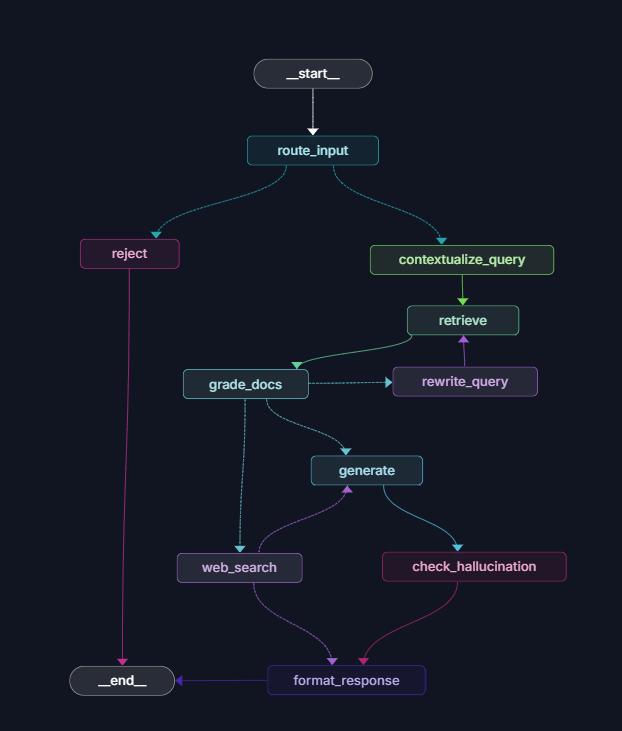
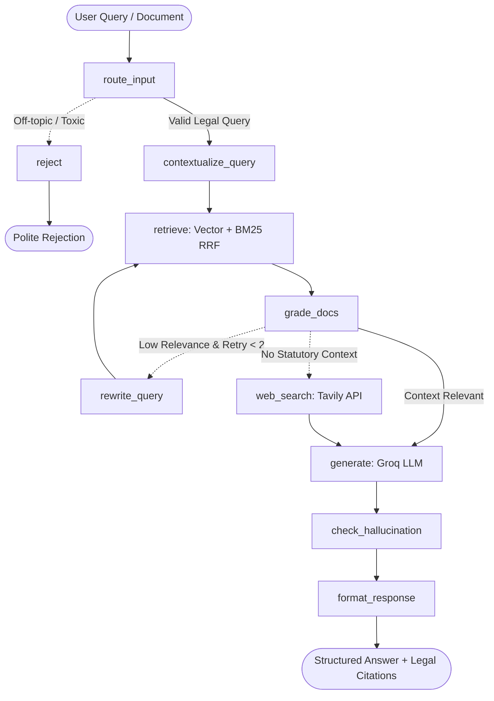

# LexAI: Indian Legal Rights Intelligence Platform

LexAI is a production-grade, self-correcting Retrieval-Augmented Generation (RAG) platform designed to help Indian citizens understand and exercise their legal rights. It pairs statutory law intelligence with user document analysis (such as FIRs, contracts, and legal notices), grounding every response in codified sections and judicial safeguards.

---

## Core Capabilities

- **Hybrid Dense and Sparse Retrieval**: Combines 1024-dimensional semantic embeddings (`BAAI/bge-m3`) via Qdrant with an exact-match `BM25Plus` index, fused using Reciprocal Rank Fusion (RRF, k=5).
- **Self-Correcting LangGraph Workflow**: State machine with input guardrails, query contextualization, automated document relevance grading, query reformulation loops, web search fallback via Tavily, and hallucination verification.
- **User Document Grounding**: Multi-format ingestion (PDFs and images with PyMuPDF and Tesseract OCR fallback), allowing users to interrogate personal legal records alongside statutory corpus laws.
- **Optimized Compute Footprint**: Dual-mode embedding architecture and pre-indexed sparse representations designed for efficient operation on resource-constrained compute.
- **Persistent Conversational Sessions**: Multi-turn legal dialogue backed by Supabase Postgres and authenticated via Supabase Google OAuth.

For detailed benchmarks, latency reductions, and trace evaluations, see the [Engineering Case Study](./CASE_STUDY.md).

---

## System Architecture





---

## Documentation Links

- **[Engineering Case Study](./CASE_STUDY.md)**: Deep dive into architectural evolution, latency benchmarks (-53.84%), retrieval accuracy gains (+90%), regex chunking fixes, and LangSmith evaluation traces.
- **[Backend Documentation](./backend/README.md)**: Complete guide to the FastAPI service, LangGraph state machine nodes, dual-mode embeddings, precomputed BM25 index, API reference, and LangGraph Studio visualizer.
- **[Frontend Documentation](./frontend/README.md)**: Details on the React 18 + Vite interface, markdown table rendering, chat sessions, document upload workflows, and Supabase auth integration.

---

## Repository Structure

```text
Lex-AI/
|-- backend/                  # FastAPI + LangGraph Python service
|   |-- app/                  # Application code (graph, routers, services, prompts)
|   |-- data/                 # Statutory PDFs and precomputed BM25 index
|   |-- scripts/              # Ingestion, schema migrations, and diagnostics
|   |-- Dockerfile            # Container definition
|   |-- langgraph.json        # LangGraph Studio dev server configuration
|   `-- pyproject.toml        # Backend dependencies (managed via uv)
|-- frontend/                 # Vite + React 18 interface
|   |-- src/                  # Components, pages, and API clients
|   `-- package.json          # Node dependencies
|-- output/                   # Performance traces, charts, and evaluation artifacts
|-- docker-compose.yml        # Local multi-service orchestrator (Qdrant)
|-- CASE_STUDY.md             # Metrics, benchmarks, and engineering journey
`-- README.md                 # Project root documentation
```

---

## Quick Start (Local Development)

### Prerequisites

- Docker Desktop installed and running
- Python 3.13+ with [uv](https://github.com/astral-sh/uv)
- Node.js 20+
- API keys: Groq API key, Supabase project credentials, Hugging Face user token (for API embeddings), and optional Tavily API key.

---

### 1. Clone the Repository

```bash
git clone git@github-hpcreates:hp-creates/Lex-AI.git
cd Lex-AI
```

---

### 2. Start Vector Database (Qdrant)

Run the official Qdrant container:

```bash
docker compose up -d qdrant
```

- Qdrant REST API will be available at `http://localhost:6333`.
- Web dashboard accessible at `http://localhost:6333/dashboard`.

---

### 3. Ingest Statutory Corpus into Local Qdrant (First-Time Setup)

The official Docker image (`qdrant/qdrant:v1.14.0`) starts with an empty volume. Before querying, populate your local vector database with the 16 statutory codes provided in `backend/data/corpus/`:

```powershell
cd backend
cp .env.example .env
uv sync
uv run python scripts/ingest_corpus.py --wipe --local
```

*(Note: If you are connecting to a managed Qdrant Cloud cluster instead, specify `QDRANT_URL` and `QDRANT_API_KEY` in `backend/.env` to skip local ingestion.)*

---

### 4. Launch Backend

Start the FastAPI application:

```powershell
uv run uvicorn app.main:app --reload --host 0.0.0.0 --port 8000
```

- Swagger API documentation: `http://localhost:8000/docs`
- Health endpoint: `http://localhost:8000/health`
- For detailed backend configuration, see [Backend Documentation](./backend/README.md).

---

### 5. Launch Frontend

In a separate terminal, navigate to `frontend/`, install packages, and start the client:

```powershell
cd ../frontend
npm install
npm run dev
```

The web application will open at `http://localhost:5173`.
- For detailed frontend configuration, see [Frontend Documentation](./frontend/README.md).

---

## Statutory Knowledge Base

The repository includes a comprehensive corpus spanning 16 Indian statutory codes and landmark acts:

- Bharatiya Nyaya Sanhita, 2023 (BNS)
- Bharatiya Nagarik Suraksha Sanhita, 2023 (BNSS)
- Bharatiya Sakshya Adhiniyam, 2023 (BSA)
- Constitution of India (COI)
- Consumer Protection Act, 2019 (CPA)
- Code of Criminal Procedure, 1973 (CrPC)
- Digital Personal Data Protection Act, 2023 (DPDA)
- Protection of Women from Domestic Violence Act, 2005 (DV)
- Hindu Marriage Act, 1955 (HMA)
- Indian Penal Code, 1860 (IPC)
- Information Technology Act, 2000 (ITA)
- Motor Vehicles Act, 1988 (MVA)
- Protection of Children from Sexual Offences Act, 2012 (POCSO)
- Sexual Harassment of Women at Workplace Act, 2013 (POSH)
- Right to Information Act, 2005 (RTI)
- Special Marriage Act, 1954 (SMA)

---

## Disclaimer

LexAI provides automated legal research and informational analysis based on statutory Indian law. It does not provide formal legal advice and does not create an attorney-client relationship. Users should consult a licensed advocate for actionable legal counsel.

---

## License

This project is licensed under the MIT License.
